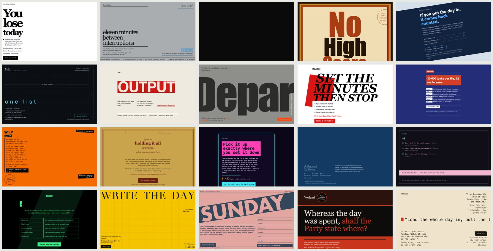
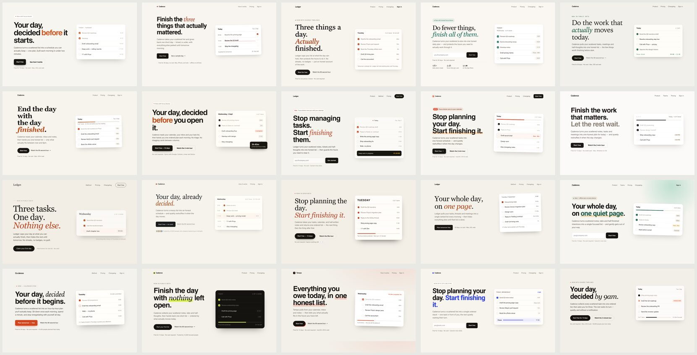

# entropy

A Claude Code plugin with one skill: `/entropy:inject`.

Ask a model for a landing page and you get the same purple gradient, text left, graphic right, every time. Ask it to "be unique" or "make random choices" and you get a different sameness. The model cannot act randomly. It predicts the most likely token, and "random-sounding" has a most likely token too.

The fix is to bring randomness in from outside. `/entropy:inject` runs `openssl rand -base64 48` in the shell, reads the string for patterns, and derives a creative direction from what it finds. Every run lands somewhere different because the input is different.

The technique is String Seed of Thought, from [Sakana AI](https://sakana.ai/).

## Install

```
/plugin marketplace add benjaminjackson/entropy-skills
/plugin install entropy@entropy-skills
```

## Use

Set a direction, then work under it:

```
/entropy:inject
```

Set a direction and do the task in one shot:

```
/entropy:inject build me a landing page for my productivity app
```

Replay a seed from the log, with the menus it was rolled against:

```
/entropy:inject --seed <string> [task]
```

Re-state the current direction later in a long conversation:

```
/entropy:inject --current
```

It works for anything where variety beats the default: visual design, prose, naming, code architecture. The skill reads the task, decides which decisions carry variety in that domain, and maps the seed onto those.

## Does it work

Yes, measured. Same brief, ten runs per arm on Opus, a judge scores each set for variety from 1 to 10, three passes with the responses shuffled. The two sets also go head to head, blind, on two judge models.

| prompt | with plugin | without | head-to-head wins |
|---|---|---|---|
| code architecture | 6.0 | 2.0 | 6 of 6 |
| landing page hero | 7.7 to 9.0 (20 runs) | 2.0 | 6 of 6 |
| app name and tagline | 7.7 | 2.0 | 6 of 6 |
| announcement paragraph | 5.7 | 2.0 | 6 of 6 |

The same brief, twenty times each, rendered and laid out as contact sheets. A hero section for a to-do app, one HTML file, nothing said about look, voice, or name.

With the skill:



Without:



Run it yourself with `evals/run.sh`. It takes `--model opus|sonnet|haiku`, `--runs`, `--passes`, and `--jobs`, which caps how many `claude` processes run at once. Design outputs are rendered with headless Chrome, or Playwright where Chrome is absent, so the judge sees pages, not CSS. `evals/fidelity.sh <results-dir>` then checks each rendered page against its own picks; 81 to 95% of visual picks are honored across runs; from eval 15 it also reads register and copy stance from the body text and footer, and register was honored on 20 of 20 pages.

## How it works

The model does not read the string for inspiration. Every random string looks the same to a model, so that lands in the same place every time. Instead, for each decision that shapes the result, the model writes a menu of 8 to 12 options that span the good work of many traditions, including the plain default. The seed is hashed into numbers, and each number picks one option by modulo. The arithmetic is shown, so every choice is auditable. Two axes are always on the menu: the register of the piece and the frame or tradition it is built on, because those are where the model's own taste hides. Visual work adds a third, the layout skeleton, and after building the page the model renders it with headless Chrome if there is one and checks the screenshot against the picks.

## Record

Each inject writes to `.entropy/` in the working directory:

- `seeds.jsonl`: one line per seed, with timestamp, task, and the derived direction. Append only.
- `current.json`: the most recent seed and direction.

To branch from an earlier point, open a fresh conversation in the same directory and run `/entropy:inject --seed <string>` with a seed from `seeds.jsonl`. The skill replays the menus recorded on that line, so the picks come out the same. A seed alone does not reproduce a direction; the menus do. To branch in another directory, copy the whole log line into that directory's `seeds.jsonl` first.
