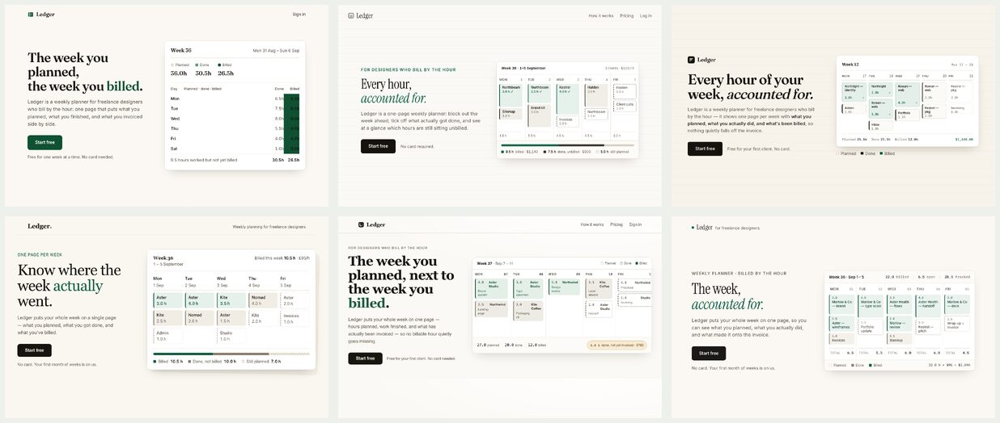
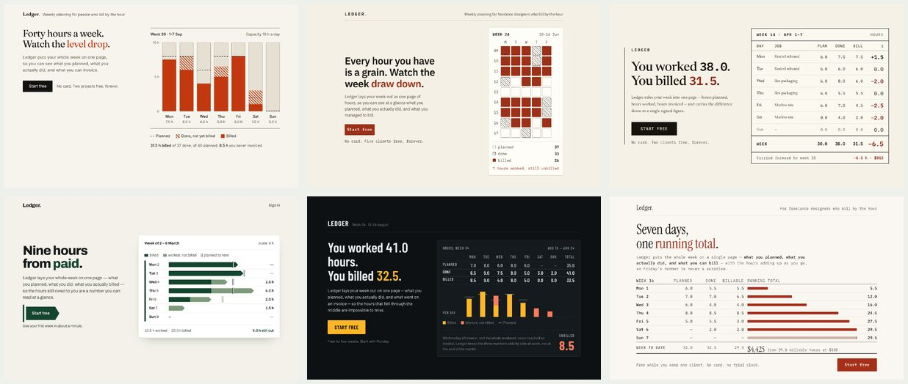
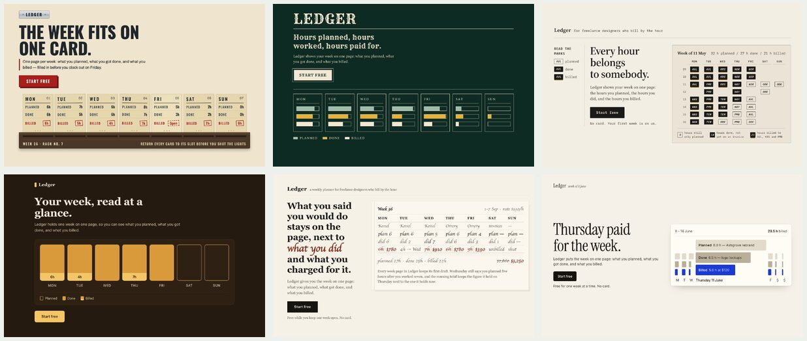

# entropy

A Claude Code plugin with two skills. `/entropy:inject` draws one random word and builds one strategy for your task from it. `/entropy:lottery` draws many words at once and hands back the strategies that sit farthest from what the model always does.

Ask a model for a landing page and you get the same purple gradient every time. Ask for an opening sentence and you get the same wry present tense. Ask it to "be unique" and you get a different sameness. The model cannot act randomly. It predicts the most likely token, and "random-sounding" has a most likely token too.

The fix is to bring randomness in from outside. `/entropy:inject` runs `openssl rand -base64 48` in the shell, hashes the string into a position in the system dictionary, and hands the model a word it did not choose: "fanega", "shielding", "unrisen". The model writes a chain of three associations from the word and builds a strategy for the task from the last link. The word is the only random part. Everything after it is the model doing real work from a starting point it would never have picked.

The technique is String Seed of Thought, from [Sakana AI](https://sakana.ai/): randomness enters as selection, never as interpretation.

## Install

```
/plugin marketplace add benjaminjackson/entropy-skills
/plugin install entropy@entropy-skills
```

Needs `/usr/share/dict/words`. macOS has it. On Debian and Ubuntu it is the `wamerican` package.

## Use

One word, one strategy, one result:

```
/entropy:inject Write the opening sentence of a short story about a man who comes home to find his house repainted a color he did not choose.
```

Several, one word each:

```
/entropy:inject Write a hero headline and one-sentence subhead for a paid one-hour session that teaches immigrants how the US financial system works. Headline under 8 words. No coaching, guidance, or training. Give me 5 variations.
```

Short work, a line, a name, a paragraph, comes back in the same reply: what was held constant, the chain, the strategy, the result. Long work, a page or a module, stops after the strategy and waits for `go`. Say `more` at any point for the next word; nothing already shown is discarded. Visual work is rendered and looked at before it is shown, and the built page and its screenshot are left on disk for you.

Flags, all optional, before the task:

- `--seed <string>`: use this string instead of a fresh one. The same words come out.
- `--log`: write the run to `.entropy/seeds.jsonl` and `.entropy/current.json`. Off by default. Nothing touches disk without it.
- `--current`: re-state the logged brief and strategy after a long conversation or a compaction. Needs a run made with `--log`.
- `--headless`: never stop, never ask. For scripts. Turns `--log` on.
- `--word <word>`: skip the seed and the draw and use this word. `--strategy`: end the reply after the chain and the strategy, even under `--headless`. Both exist so the lottery below can run one draw in a fresh context and read the strategy back.

## Lottery

One word gives one strategy that is not the default. It does not tell you what the default was. `/entropy:lottery` draws twenty-four words, writes one strategy each in twenty-four separate contexts, and has a judge name what they share. Whatever three or more share is the model's habit for this task. The strategies farthest from the crowd come back for you to pick from. A second round, `--rounds 2`, bans the top habits and draws again; in testing that moved all six strategies to the model's next default rather than spreading them, so it is a way to map the next layer, not a better pick.

```
/entropy:lottery Write the opening sentence of a short story about a man who comes home to find his house repainted a color he did not choose.
```

Flags: `--n` words per round (24), `--rounds` (1), `--keep` (6), `--build` to render the kept strategies before the pick, `--model` and `--judge-model` (opus), `--headless`, `--seed`. It uses the Claude Code Workflow tool; every strategy file and judge verdict lands under `.entropy/lottery/<ts>/`, and every named habit is appended to `.entropy/habits.jsonl`, one line each, so the habits build up per task over time.

A run with defaults is twenty-five Opus agents, about 1.2 million tokens, most of it input, and seven to eight minutes. Building six survivors costs another 275,000 to 350,000 tokens, and three judge passes over a set 130,000 to 155,000. On the story prompt it named twelve habits and returned six survivors that read nothing alike. Keep the strategy model the same as the one that will build; the habits found are that model's.

The scores below are variety scores, 1 to 10, from one Opus judge over three shuffled passes with six items per arm. They say how far apart the six results are and nothing about how good any one of them is. Without the plugin is six plain `claude -p` runs of the same brief, no settings and no skill. Inject is six runs of `/entropy:inject --headless`, one word and one strategy each, in six separate contexts. The lottery is one draw of twenty-four strategies, six survivors, built by the same model.



*Without the plugin, the Ledger design brief: variety 2, 2, 2.*



*With `/entropy:inject`, the same brief: variety 4, 4, 4.*



*With the lottery, the same brief: variety 6, 6, 6.*

The judge on the plain arm saw the same page six times: cream ground, serif headline with one green word, Inter body, white rounded card with a Monday to Friday grid, and two of the headlines word for word the same across runs. On the inject arm the pictures differ, an hour-block heat map, a signed-variance table, arrow bars against a planned tick, columns against a capacity ceiling, while five of six keep a cream page with one rust accent, copy on the left, a boxed week view on the right, and the last phrase of the headline set in the accent colour. On the lottery arm the pictures differ, a time-card rack, a struck-through ink ledger, one day blown up with the rest as ribbons, a lacquer sign board, client-stamped hour blocks, while the shell recurs in five of six: warm ground, serif display, copy stack on the left, seven day columns.

Prose moves less. On the paragraph in `evals/prompts/prose.md` the plain arm scored 2, 2, 2, the inject arm 2, 2, 2, and the lottery arm 4, 3, 3. The inject paragraphs run the same script as the plain ones: second person, a list lost between laptop and phone, a pivot on starting today, three negations, the list waiting for you; one word did not move it. The anecdote differs and the voice does not: all six survivors are second person, past pain then a dated pivot, a flat close. The lottery's own strategy judge had named that voice as a habit, with eighteen to twenty-four of the twenty-four strategies in it. A habit nearly every strategy has leaves no survivor far enough from it to pick, so on prose the next layer needs a ban round, not a bigger draw.

## What is held constant

Before the word is drawn, the skill writes down what the user has already fixed, in the user's words, with a test for each: a word count, a banned word to grep for, a voice file to match. That brief comes before the strategy and is checked first on the result. The word varies taste inside the brief and never overrides it, and the same goes for house style in CLAUDE.md.

## Why a word

The first version read the random string for patterns. Every base64 string looks the same to a model, so five seeds gave five near-identical directions. The second version had the model write menus of options on a dozen axes and hash the seed into picks. That measured well on a landing-page eval, 8.3 against a baseline of 2.0, and grew to 4,400 words of procedure. On the first real copy task with a person and a brief it produced ten honored picks and no line anyone would keep, because the decision that mattered, length, was on no menu, and because a headline built from ten independent picks is a collision, not a strategy.

A dictionary word fixes both. It is far from every other word in a way no menu option is, there are a hundred thousand of them, and the model reasons from it to one coherent strategy a person can read and argue with. The chain is shown so the user can see where the idea came from. The word itself does not appear in the result.

The history, with every eval and its numbers, is in `docs/history/spec-menus.md`. The current spec is `docs/SPEC.md`.

## Does it work

The menu version was measured over seventeen eval rounds on Opus; those numbers are in the history file. The word version has been tested by hand on a headline with a brief and a story opening, on Sonnet and Opus. On the headline, five words gave five strategies a copywriter could argue over: the session as translation, as a con exposed, as freedom, as a crossing, as plain mechanics. Both eval prompts have since been judged with the lottery arm against a plain arm, and those variety scores are in the lottery section above. An inject arm, one `/entropy:inject --headless` run per item, scored 4, 4, 4 on the Ledger brief and 2, 2, 2 on the paragraph against the same plain arm.

`evals/run.sh` runs the same prompt in two arms, with and without the plugin, and judges the sets for variety. It takes `--model opus|sonnet|haiku`, `--runs`, `--passes`, `--jobs`, and `--arms with|without|both`. `evals/judge.js` is the same judging as a Workflow script over any set of files, screenshots with their code or plain text files, which is how the lottery's built survivors were scored. `evals/fidelity.sh` was written for the menu version and does not grade this one yet.
